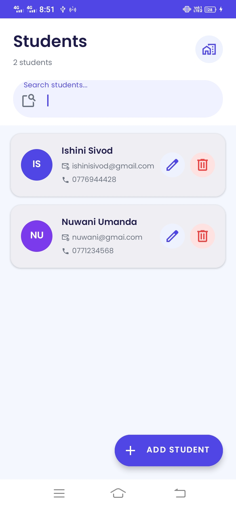

# 📱 Student Management Mobile Application

## 📚 Module
CCS3351 – Mobile Application Development  

## 🧪 Activity
Connecting SQLite Database to Android Application  

---

## 👨‍🎓 Group Members

- CIT-23-02-0044 – Ishini Sivod  
- CIT-23-02-0153 – Nuwani Umanda  

---

## 📖 Introduction

This project is a basic **Student Management Mobile Application** developed using **Android Studio** and **SQLite Database**.

The application allows users to:

- Add new student records  
- View all students  
- Update student details  
- Delete student records  

SQLite is used as a local database to store student information directly on the mobile device.

---

## 🛠️ Technologies Used

- Android Studio  
- Java  
- SQLite Database  
- XML for UI Design  

---

# 🗄️ Database Design

## Database Information

| Item | Details |
|------|---------|
| Database Name | StudentDB |
| Table Name | students |

---

## 📋 Table Structure

| Field Name | Data Type | Description |
|------------|-----------|-------------|
| id | INTEGER | Primary Key (Auto Increment) |
| name | TEXT | Student Name |
| email | TEXT | Student Email |
| phone | TEXT | Student Phone Number |

---

# ⚙️ Database Helper Class

A helper class named `DatabaseHelper` was created by extending `SQLiteOpenHelper`.

## Functions Implemented

### ➕ insertStudent()
- Adds a new student record into the database  
- Uses `ContentValues`  
- Returns `true` if insertion is successful  

### 📄 getAllStudents()
- Retrieves all student records  
- Uses `Cursor`  
- Displays records using Toast or ListView  

### ✏️ updateStudent()
- Updates an existing student record using ID  
- Returns the number of updated rows  

### ❌ deleteStudent()
- Deletes a student record from the database  
- Returns the number of deleted rows  

---

# 🎨 User Interface Design

The application interface contains:

- EditText – Name  
- EditText – Email  
- EditText – Phone  

## Buttons
- Add  
- View  
- Update  
- Delete  

When the user clicks a button:
1. The button calls a database method  
2. Database operation is executed  
3. Result is displayed using Toast or ListView  

---

# 🔄 How Database Connection Works

1. `DatabaseHelper` is initialized when the app starts  
2. SQLite database is automatically created if it does not exist  
3. `onCreate()` method creates the `students` table  
4. Button clicks execute insert, update, delete, or view methods  
5. `SQLiteDatabase` executes SQL commands  
6. Data is stored locally on the device  

✅ SQLite does not require an internet connection.

---

# 📸 Screenshots

## Application UI

```md



